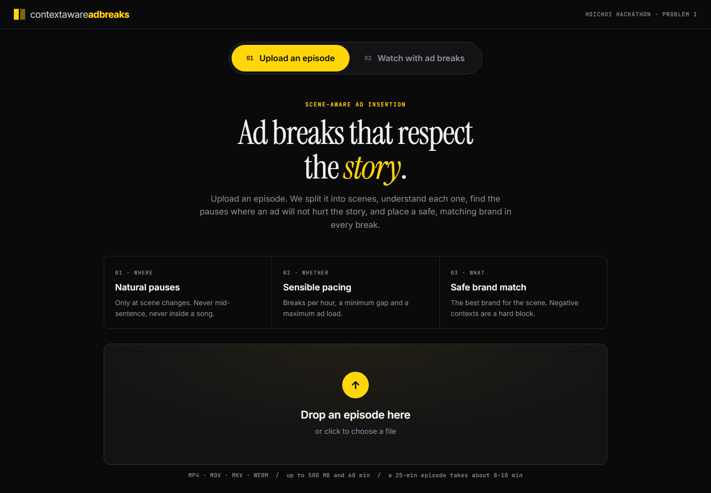
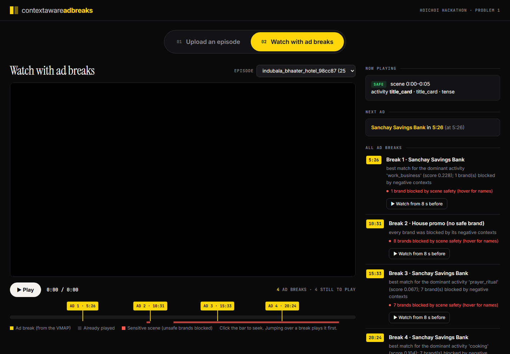

# contextawareadbreaks — Context-Aware Video Segmentation & Intelligent Ad Placement

**Hoichoi Hackathon · Problem 1** · Track: Video Understanding / AdTech

**Live demo:** **https://contextawareadbreaks.centralindia.cloudapp.azure.com**

**Download the workflow:** [Workflow.pdf](Workflow.pdf): how it was planned and built, with a guided tour of the website.

**contextawareadbreaks** takes a long Bengali drama episode and decides **where** an ad break can go without hurting the story, **whether** a break should go there at all, and **what** brand fits that moment. It then produces:

- a standard **VMAP 1.0** ad-break file (with inline VAST 3.0 ads),
- a **debug JSON** that explains every decision, and
- a **web player** that really pauses the episode, plays the ad, and continues from the same frame.

Everything runs on **free and open-source tools**. No model was trained, and no real company names are used.





---

## Contents

1. [Try the live demo](#try-the-live-demo)
2. [What is done](#what-is-done)
3. [The three decisions](#the-three-decisions)
4. [How it works (pipeline)](#how-it-works-pipeline)
5. [Results on real episodes](#results-on-real-episodes)
6. [Server details](#server-details)
7. [Run it on your own computer](#run-it-on-your-own-computer)
8. [Configuration](#configuration-no-code-changes-needed)
9. [Outputs](#outputs)
10. [Tests](#tests)
11. [Project layout](#project-layout)
12. [Honest limits](#honest-limits)

---

## Try the live demo

1. Open **https://contextawareadbreaks.centralindia.cloudapp.azure.com**.
2. On **01 Upload an episode**, drop a video file (MP4, MOV, MKV or WebM, up to 500 MB and 60 min).
3. Watch each step turn green. A 25-minute episode takes about **5–7 minutes** on the server.
4. Open **02 Watch with ad breaks** and pick the episode. The yellow marks on the timeline are the ad breaks, and the red marks are sensitive scenes.
5. Press **Play**, or click **Watch from 8 s before** next to any break to jump straight to it. The episode pauses, the ad plays, and the episode continues.

Episodes that were already processed are listed in the player, so you can watch without uploading.

---

## What is done

The project was built in **10 checkpoints**. Each one was tested before starting the next. The full story, with a tour of the website and real examples, is in [Workflow.pdf](Workflow.pdf).

| # | Checkpoint | Status |
|---|---|---|
| 1 | Read the video: details and 16 kHz audio | ✅ Done |
| 2 | Find camera cuts (shots) and ignore flashes | ✅ Done |
| 3 | Find when people speak (Silero VAD) | ✅ Done |
| 4 | Bengali speech to text with a time for every word (Whisper large-v3 via Groq) | ✅ Done |
| 5 | Join shots into scenes (colour + SigLIP + sound continuity) | ✅ Done |
| 6 | Label each scene's activity, setting and mood, and flag sensitive scenes | ✅ Done |
| 7 | **WHERE**: find the exact safe cut point (never mid-sentence, never inside a song) | ✅ Done |
| 8 | **WHETHER**: choose breaks under the pacing rules | ✅ Done |
| 9 | **WHAT**: brand matching, hard block on negative contexts, safety check | ✅ Done |
| 10 | VMAP + debug JSON + web player | ✅ Done |

**Also done:**

- ✅ A **web app** where anyone can upload an episode and follow each step live.
- ✅ A **player** that reads the VMAP, cuts to the ad and resumes, and shows why each ad was placed.
- ✅ **Deployed online** on an Azure server with HTTPS, running around the clock.
- ✅ Tested on **six different episodes** (20–39 min). Every run passed the safety check.
- ✅ A **9th brand** that the system had never seen works without any code change (see [Tests](#tests)).

---

## The three decisions

| | Question | How we answer it |
|---|---|---|
| **WHERE** | Is this a natural place to cut? | Only at scene changes, and only inside a real silence. The system checks word by word that no one is mid-sentence. A cut is never placed inside a song or continuous music. |
| **WHETHER** | Should there be a break here? | A pacing policy sets the breaks per hour, the minimum gap, the maximum ad load, and no-break zones at the start and end. An exact search then picks the best set of breaks that follows every rule. |
| **WHAT** | Which brand belongs in this slot? | Brands are ranked by how well their target contexts match the scene's main activity. If a scene touches a brand's `negative_contexts`, that brand is **hard-blocked** (not just scored lower). If every brand is blocked, a house promo plays. A final safety check re-verifies every placement and fails the run if anything is wrong. |

**Works on any video.** The code contains no timestamps, video names or brand assignments. Every decision comes from the video itself plus the JSON files in `config/`.

---

## How it works (pipeline)

| # | Step | What it does | Model / tool |
|---|---|---|---|
| 1 | `ingest` | Reads the video's details and extracts 16 kHz audio | ffmpeg |
| 2 | `shots` | Finds camera cuts and ignores flashes | ffmpeg → NumPy (colour histograms) |
| 3 | `speech` | Finds when people speak | Silero VAD (ONNX) |
| 4 | `transcribe` | Produces Bengali words with timestamps and sentence ends | Whisper large-v3 via Groq's free API |
| 5 | `keyframes` | Takes one picture per shot | ffmpeg |
| 6 | `scenes` | Joins shots into scenes | Colour + SigLIP visual similarity + sound continuity |
| 7 | `music` | Finds songs and music, and the pauses inside them | AST (AudioSet) |
| 8 | `context` | Labels each scene's activity, setting and mood, and flags sensitive scenes | SigLIP zero-shot + Bengali keywords |
| 9 | `breaks` | **WHERE**: scores safe break points | Rules on speech, words, sentences, music and scene change |
| 10 | `pacing` | **WHETHER**: chooses breaks under the pacing policy | Exact combinatorial search |
| 11 | `match` | **WHAT**: ranks brands, hard-blocks negative contexts, runs the safety check | MiniLM text embeddings |
| 12 | `export` | Writes the VMAP 1.0 file (inline VAST 3.0) and the debug JSON | — |

All models are free and open. The three local models (about 1.2 GB) are downloaded by `python -m adbreak.fetch_models`:

| Model | Used for |
|---|---|
| `google/siglip-base-patch16-224` | Scene similarity and scene context |
| `MIT/ast-finetuned-audioset-10-10-0.4593` | Song/music detection |
| `sentence-transformers/all-MiniLM-L6-v2` | Matching brand contexts to scenes |
| Silero VAD (inside the `silero-vad` package) | Speech detection |

**Why speech-to-text uses an API:** speech-to-text is the heaviest job. We send the compressed audio (about 5 MB) to **Groq's free Whisper large-v3 API** in one request, and every word comes back with its start and end time in under a minute. This keeps our own server small and free, while the light models run on our server.

---

## Results on real episodes

| Video | Length | Breaks | Safety check |
|---|---|---|---|
| bhojon_bilashi | 20.5 min | 3 | PASS |
| money_honey | 21.7 min | 3 | PASS |
| mohanagar | 23.3 min | 3 | PASS |
| feluda | 25.6 min | 4 | PASS |
| indubala_bhaater_hotel | 25.9 min | 4 | PASS |
| mandaar | 39.2 min | 5 | PASS |

**Processing time on the live server** (4 vCPU, no GPU):

| Video | Length | Time from upload to finished |
|---|---|---|
| indubala_bhaater_hotel | 25.9 min | 5.4 min |
| feluda | 25.6 min | 6.9 min |
| 7-min clip | 7.0 min | 3.3 min |

---

## Server details

| Item | Value |
|---|---|
| **Public URL** | https://contextawareadbreaks.centralindia.cloudapp.azure.com |
| **Cloud** | Microsoft Azure (Azure for Students) |
| **Region** | Central India |
| **Machine** | Standard B4as_v2: 4 vCPU, 16 GB RAM, no GPU |
| **Operating system** | Ubuntu 24.04 LTS |
| **How the app runs** | Docker Compose with two containers: `app` (FastAPI + the pipeline) and `caddy` (web server) |
| **HTTPS** | Caddy gets a free Let's Encrypt certificate automatically |
| **Domain name** | Azure DNS name label on the VM's public IP |
| **Storage** | Uploaded videos and results are kept in the Docker volume `appdata`, so they survive restarts |
| **Speech-to-text** | Groq's free Whisper large-v3 API (only the `GROQ_API_KEY` is stored on the server) |
| **Uptime** | Both containers use `restart: always`, so they come back after a reboot |
| **Limits** | One video is processed at a time; uploads up to 500 MB and 60 min |

### Deploy or update the server

From your computer (needs SSH access to the VM and a `.env` file with your Groq key):

```bash
bash deploy/push.sh <server-ip> azureuser contextawareadbreaks.centralindia.cloudapp.azure.com
```

The script:

1. copies the app code to the server (only the `GROQ_API_KEY` line from `.env` is sent),
2. installs Docker if it is missing,
3. builds the image (the models are downloaded during the build), and
4. starts the app and Caddy with HTTPS.

> Do not redeploy while a video is being processed, because the restart stops that job. Check `/api/jobs` first.

Useful addresses on the server:

| Address | What it returns |
|---|---|
| `/` | Upload page |
| `/watch?v=<video>` | Player |
| `/vmap/<video>.xml` | VMAP file |
| `/debug/<video>.json` | Debug JSON |
| `/api/jobs` | Status of every processing job |
| `/healthz` | Health check |

---

## Run it on your own computer

You need Python 3.11, ffmpeg (on your `PATH`, or the Windows build in `tools/ffmpeg/bin/`), and a free [Groq API key](https://console.groq.com/keys).

```bash
git clone https://github.com/ushnardra/HOICHOI_HACKATHON_ADBREAK.git
cd HOICHOI_HACKATHON_ADBREAK
python -m venv .venv
# Windows: .venv\Scripts\activate      Linux/macOS: source .venv/bin/activate

# 1) PyTorch for your machine (pick one)
pip install torch==2.6.0 torchaudio==2.6.0 --index-url https://download.pytorch.org/whl/cpu     # CPU
pip install torch==2.6.0 torchaudio==2.6.0 --index-url https://download.pytorch.org/whl/cu124   # NVIDIA GPU

# 2) everything else
pip install -r requirements.txt

# 3) models (~1.2 GB) and the synthetic ad videos
python -m adbreak.fetch_models
python -m adbreak.creatives

# 4) your Groq key
cp .env.example .env        # then put your key after GROQ_API_KEY=
```

### Option A: web app

```bash
python -m adbreak.server 8000
```

Open http://localhost:8000, upload a video on **01 Upload an episode**, then watch it on **02 Watch with ad breaks**.

### Option B: command line

Put the video in `assets/<name>.mp4`, then run:

```bash
python -m adbreak.run_all <name>
```

The results are saved to `output/<name>.vmap.xml` and `output/<name>.debug.json`, and the files from each step are saved in `work/<name>/`. You can also run one step on its own, for example `python -m adbreak.breaks <name>`.

### Or with Docker

```bash
docker build -t adbreak .
docker run -p 7860:7860 --env-file .env adbreak
```

Then open http://localhost:7860.

---

## Configuration (no code changes needed)

| File | What you can change |
|---|---|
| `config/brands.json` | The synthetic brand list: `name`, `category`, `target_contexts`, `negative_contexts`, `creative`, `duration_sec` |
| `config/pacing.json` | Pacing rules. Defaults: 8 breaks/hour (rounded up), at least 240 s between breaks, at most 10% ad time, 30 s breaks, and no break in the first 5 min or the last 3 min. **These are our team's demo settings, not official Hoichoi rules.** |
| `config/music.json` | Thresholds for the song/music check |
| `config/context_labels.json` | The activities, settings, moods and sensitive topics the scene labeller knows |
| `config/brand_matching.json` | Brand-matching weights and Bengali keyword lists |

**Adding a new brand:** add one entry to `config/brands.json`, then run `python -m adbreak.creatives` to make its placeholder ad video. It is matched and hard-blocked like every other brand, with no code change.

---

## Outputs

- **VMAP 1.0** (`/vmap/<video>.xml`): one `<vmap:AdBreak>` per break with its `timeOffset`, each holding an inline VAST 3.0 ad.
- **Debug JSON** (`/debug/<video>.json`): every scene with its context and sensitivity, every break candidate with its score or the reason it was rejected, the pacing decisions, each brand ranking, the blocked brands and why, and the safety-check result.
- **Player** (`/watch?v=<video>`): reads the VMAP, pauses the episode at each break, plays the ad and resumes at the same frame. It shows why each ad was placed there.

---

## Tests

Every checkpoint was tested before we moved on. The main checks were:

- **WHERE:** no break is ever inside speech or a song.
- **WHETHER:** every pacing rule holds (breaks per hour, minimum gap, maximum ad load, no-break zones).
- **WHAT:** negative contexts always hard-block a brand. A stress test matched brands at every safe break point, not only the chosen ones, and never put a food brand next to a sensitive scene.
- **Unseen brand:** a 9th brand the system had never seen was added at run time and was matched and blocked correctly, with no code change.
- **Output:** the VMAP and the debug JSON are valid and agree with each other.
- **No hard-coding:** the code contains no timestamps, video names or brand choices.

The test scripts are kept outside this repository, which holds only the app itself.

---

## Project layout

```
adbreak/        pipeline steps, web server (server.py) and run_all.py
config/         brands, pacing, music, context labels, matching weights
player/         web UI: upload page and player (VMAP reader + ad cut-in)
deploy/         docker-compose, server setup and push script
Dockerfile      CPU image used on the server
Workflow.pdf    how the project was planned and built, with a website tour
```

These folders are **not** in the repository because they are large or private. They are created by the setup commands above: `.venv/`, `models/`, `.cache/`, `tools/`, `assets/` (videos), `work/`, `output/` and `.env` (your API key).

---

## Honest limits

- Scene context comes from zero-shot image models and Bengali keywords, so unusual scenes can be labelled `unclear`. The system is built to fail safe: if a sensitive topic is uncertain, the unsafe brand is blocked, and if no brand is safe a house promo plays.
- Some Bengali words may be transcribed imperfectly. Break safety depends on *when* words are spoken, not on perfect spelling, and the speech detector (Silero VAD) is a second, independent guard.
- The server processes one video at a time. A 25-min episode takes about 5–7 min on the 4-vCPU server.

---

*All brand names are invented. No real company names are used.*

## License

[MIT](LICENSE)
